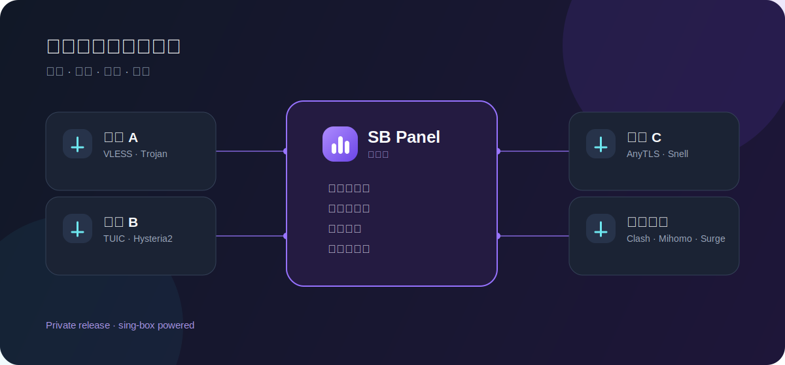

# SailBox

> 私有发行的 sing-box 管理面板，面向个人、家庭与多服务器使用。



## 一个面板，统一管理

- 一键启用 VLESS Reality、Trojan、AnyTLS、TUIC、Hysteria2、Snell
- 管理用户、流量配额、到期时间、订阅与客户端导入
- 用户分组、跨服务器管理与聚合订阅
- sing-box 由独立 systemd 服务运行，面板只负责配置、校验与重载

## 一键安装

支持 systemd 的 Linux，兼容 `amd64` 与 `arm64`。

```bash
curl -fsSL https://raw.githubusercontent.com/oldwangnewbe/sb-panel/main/install.sh | sudo bash
```

安装过程会询问域名、证书、端口和管理员账号；直接回车即可使用默认值。再次运行同一条命令会安全升级到最新发行版。

## 发行方式

本仓库仅提供安装器、使用说明和已编译的发行文件；SailBox 核心源码不公开。详见 [LICENSE](LICENSE)。
